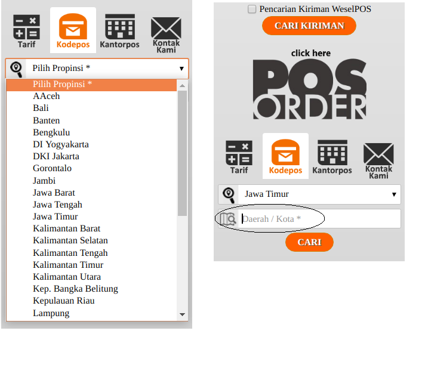
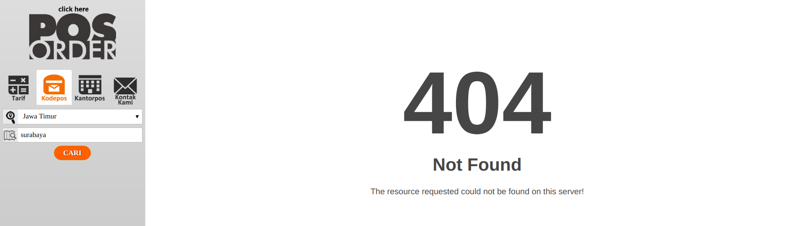
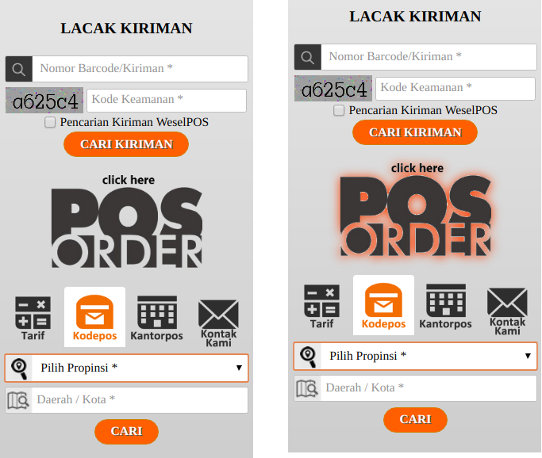

# assignment-0-natashaval
> Name = Natasha Valentina
> 
> NRP = 05111640000183

## Bad UI / UX Design
This assignment will cover about bad design and bad user experience, which are taken from **three** sample websites found in the internet. While doing the assignment, I got help from <em>my sister</em> to test those websites.  
Websites will be run on Google Chrome browser with 1920 x 1080 windows screen. The website features discussed will be:
1. [Shopee Shopping Cart](#shopee-e-commerce)
2. [FirstMedia Header](#firstmedia-header)
3. [Pos Indonesia](#pos-indonesia)

<em>Extra: bold sentences point out the design mistakes and given solutions.</em>

## Shopee (E-Commerce)

&emsp;&emsp;&emsp;This is the first page that users will encounter after they have finished adding items in their carts. First of all, **their layout in shopping cart are way to cramped**. Their header are already filling 10% of the page screen and the footer, consisted of total payment and applied voucher, also fills up to 25% of page screen. The rest of the screen is supposed to show the products to be bought. However, the remaining space is even not enough to show the first product, and yet the rest. **My solution idea is to give enough proportion for each sections**. Header size should be smaller since it only shows company logo and search bar. Meanwhile, footer section for checkout is not really necessary to float around, it will be sufficient if it is placed at the end of item list. Therefore, the remaining space will be focused in showing item list to be bought.

&emsp;&emsp;&emsp;The second problem lies within item delete button. As shown with red circle on the picture above, **delete button is almost looked like an ordinary text.** Since <em>delete </em> plays a significant role in any service, it should be differentiate than the rest of the element. **The most obvious solution is to change <em>"Hapus"</em> text to a button. The design idea will be an outlined red button with trash icon.** The idea is choosen because outline button will not be distracting user too much, compared to the full block button. Next, red is applied to show that "delete" is rather a dangerous action, so users will be aware of it. Lastly, trash icon will be optional to give a vivid picture of the action.

&emsp;&emsp;&emsp;The last design to be critized is about variation select menu. When users want to shop items with variation such as color, type, or size they will choose it beforehand. Then in the shopping cart, user will be shown his choice and whether he wants to change it or not. As shown in the picture, **variation select menu comes in different design whilst they are a same component.** The first one with green box around shows a confirmation button, while the second one with blue box around simply change the choice. **Since they are belong to the same component, designer should choose which one will be suitable**. My preference will be the second one, the one without confirmation, because it is simply change the choice without asking user to do more action by pressing another button. Generally, user will be aware of their choice by re-read it again from item list. Hence, it is not necessary to give confirmation button in variation select menu.

&emsp;&emsp;&emsp;In the end, designing a website will be a challenging one to suit customers' taste and to simplify user actions.

## FirstMedia Header

&emsp;&emsp;&emsp;At the first glance, FirstMedia header is quite okay since it shows several important menu and has a nice vibrant color and font. However, after I **scroll the page, the header is fixed at the top**. This becomes a disadvantage because the fixed header take much space after scrolling and hide important info beneath. The solution given is to **make the header stay still at the top and provide a small "To Top Page" button** at right bottom corner. This will make users interested in reading information in the main section and do not get distracted by the big header. The "To Top Page" button at the right bottom corner will ease users when they want to access header at the top and move to other links.

&emsp;&emsp;&emsp;These three megamenu above taken from Products, Special Deals!, and What's On menu. It is true that mega-menu becomes popular these days. However, the design application of mega menu in FirstMedia header is confusing. **The size of each mega drop-down navigation is different one to another**. Additionally, **the layout are also contrast.** Products dropdown menu shows the link sections at the left side and fills the right side with big pictures. Next, Special Deals! dropdown menu also shows the link sections at the left side, but they omit the picture. At contrast, What's On menu shows completely different layout. It provides a submenu to be accessed by users. My preferences is to **make an universal size of mega-menu** then fill the exact space with links. Moreover, picture, <em>or even bigger picture,</em> will be unnecessary since it can be shown at the main section or ommitted for good.

Lastly, **this gif for Contact Me is rather annoying**. It is placed at the top right in header menu with vast size, it's gold pallete color is distracting, and it's moving motion is ridiculous. The supporting critique given will be **move the contact me button at fixed position on bottom-right of the page** and the design should be keep simple with neutral color choice.

## Pos Indonesia

&emsp;&emsp;&emsp;In [PosIndonesia](http://www.posindonesia.co.id/) website, a side menu is available for customers to serve several purposes. As the picture shown above, it gives a service to search for Postal Code in Indonesia. However, after choosing province, the next **step to search for city name is not available**. It only leaves a blank input text, for the user to input it himself. This turns out to be a bad idea since sometimes users can not remember the city name correctly, especially the one outside his region. **Solution is to give a drop-down select menu with search bar for user to search the city name (kota / kabupaten).** It also would be easier to give another dropdown to detect <em>kecamatan and kelurahan </em> so users can have post code correctly based on given address. In addition, after I try to search for Surabaya, it yields 404 Error Not Found. This will be a bad design because the service is not yet ready to be served to public.

&emsp;&emsp;&emsp;Another part bad design in the sidebar menu is the **logo of click here Pos Order**. It only show a logo asking to be clicked, without further description what is PosOrder. After the cursor hover to the logo, it shows a red drop shadow around the logo. The color pallette for drop shadow is not suitable since red color is usually used to show alert or danger. The solution is probably ** giving a tooltip to give brief explanation of PosOrder and change a hover drop shadow to a neutral color such as dark grey**.